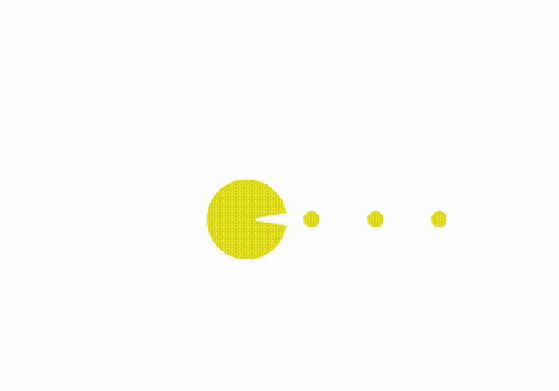

Mini Frontend projects
---

`This repository contains some mini frontend projects that I have done while learning frontend development.`

#1. Youtubel logo (only html, css)
---
/output.png)

#2. 2D House (only html, css)
---

#3. Pacman animation
---

I could not find source code oargif this project. Live demo: https://pacman-for-jasur.netlify.app

#4. Animation Car
---

#5. Box shadow
---
